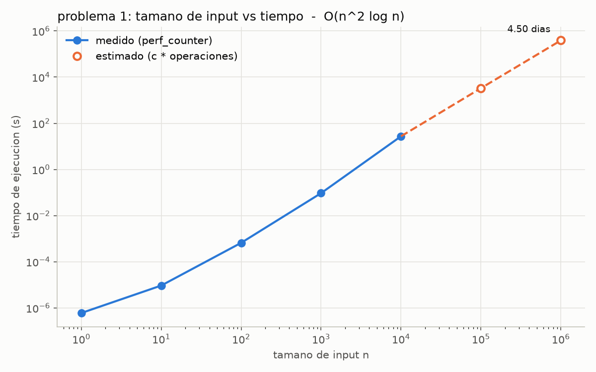
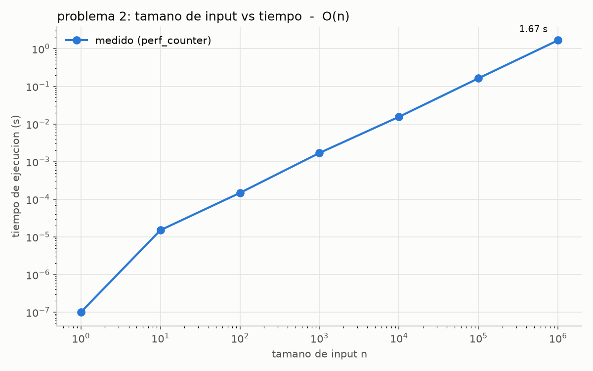
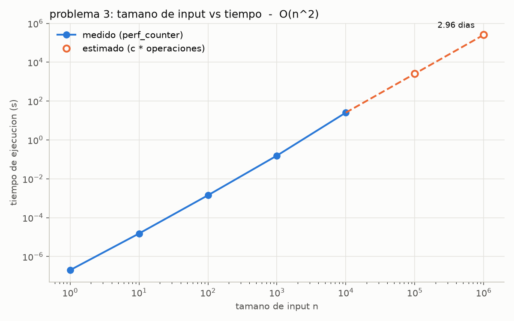

# Laboratorio 8 - Teoria de la Computacion

Analisis de complejidad (Big-O) y profiling de los programas de los problemas 1, 2 y 3.
Los programas originales estan en C; aqui se implementaron en **Python** (traduccion directa,
linea por linea) y se midio su tiempo de ejecucion con `n = 1, 10, 100, 1000, 10000, 100000, 1000000`.

## Respuestas de los ejercicios sin codigo

Las respuestas de los ejercicios que no llevan codigo estan en el pdf
**[respuestas/lab8resp.pdf](respuestas/lab8resp.pdf)**:

- Problemas 1, 2 y 3, parte a: complejidad Big-O con todo el procedimiento
- Problema 4: mejor caso, caso promedio y peor caso de busqueda lineal, busqueda binaria y quick sort
- Problema 5: verdadero o falso con su justificacion

La parte b de los problemas 1, 2 y 3 (implementacion y profiling) esta en el codigo de este repo y en la seccion de [Resultados](#resultados).

## Video

Video de la ejecucion (no listado en YouTube): **https://youtu.be/Yvs3zOlXu6E**

## Estructura del repo

```
.
├── src/
│   ├── medicion.py      # todo lo comun: medir con limite de tiempo, cProfile, tabla y grafica
│   ├── problema1.py     # O(n^2 log n)
│   ├── problema2.py     # O(n)
│   └── problema3.py     # O(n^2)
├── tests/
│   └── test_conteos.py  # pruebas: la traduccion hace lo mismo que el codigo en c
├── resultados/
│   └── problemaX/
│       ├── tabla.md            # tabla tamano de input vs tiempo
│       ├── tabla.csv           # la misma tabla en csv
│       ├── grafica.png         # grafica tamano de input vs tiempo
│       └── perfil_cprofile.txt # reporte de cProfile
├── respuestas/
│   └── lab8resp.pdf     # respuestas de los ejercicios sin codigo
└── requirements.txt
```

## Como ejecutar

Requisitos: Python 3.10 o mas nuevo.

1. Instalar dependencias (solo se usa `matplotlib` para las graficas):

   ```bash
   pip install -r requirements.txt
   ```

2. Correr cada problema desde la raiz del repo:

   ```bash
   python src/problema1.py
   python src/problema2.py
   python src/problema3.py
   ```

   Cada uno imprime la tabla en la terminal y guarda tabla, grafica y reporte de cProfile en `resultados/problemaX/`.

3. Opciones utiles:

   ```bash
   # cambiar el limite de tiempo por corrida (en segundos, default 300)
   python src/problema1.py --limite 60

   # probar solo algunos n (para una prueba rapida)
   python src/problema3.py --valores 1 10 100 1000
   ```

4. Correr las pruebas:

   ```bash
   python -m unittest discover -s tests -v
   ```

## Como se hizo el profiling

- **Tiempo:** cada `funcion(n)` se corre en un proceso aparte y se mide con `time.perf_counter()`.
  Si la corrida es rapida se repite hasta 5 veces y se reporta el minimo (como hace `timeit`).
- **cProfile:** ademas se corre una vez con `cProfile` para ver en que se va el tiempo y cuantas
  veces se llama cada cosa. En los problemas 2 y 3 el numero de llamadas a `print` que reporta
  cProfile coincide exacto con el conteo teorico (10,000 y 8,332,500). La tabla no se saca con
  cProfile porque con el profiler activo python corre mas lento (por ejemplo, el problema 1 con
  n = 1,000 tarda 0.41 s con cProfile contra 0.094 s sin el).
- **Salida a devnull:** el `printf("Sequence\n")` se traduce a `print("Sequence")`, pero durante la
  medicion la salida se manda a `os.devnull`. El `print` se ejecuta completo, solo que no se
  dibuja en la terminal; si no, se estaria midiendo que tan rapida es la consola y no el algoritmo.
- **Valores estimados:** con n = 100,000 y 1,000,000 los problemas 1 y 3 tardarian desde ~40 minutos
  hasta varios dias en Python. Para esos n el programa no los corre (o los mata si pasan el limite)
  y estima el tiempo asi:
  - se cuenta exactamente cuantas operaciones hace el algoritmo, `f(n)` (formula cerrada, comprobada en las pruebas)
  - con el n mas grande que si se midio se saca `c = tiempo / f(n)` (segundos por operacion)
  - tiempo estimado = `c * f(n)`

  En las tablas y graficas los valores estimados estan marcados como **estimado** (circulos huecos, linea punteada).
- **Pruebas:** `tests/test_conteos.py` compara la version en Python contra una traduccion literal
  del C con `while` (misma inicializacion, condicion e incremento) y contra las formulas de conteo,
  para n de 0 a 69 y algunos valores alrededor de potencias de 2.

## Resultados

Maquina: Python 3.11.9, Windows 11, Intel Core (Tiger Lake, family 6 model 140).

### Problema 1 - O(n² log n)

Operaciones exactas: `(n - n/2 + 1) * (n - n/2) * (floor(log2 n) + 1)`

| n | operaciones | tiempo (s) | tiempo legible | tipo |
|---:|---:|---:|---:|:---:|
| 1 | 2 | 6.000e-07 | 0.60 us | medido |
| 10 | 120 | 9.300e-06 | 9.30 us | medido |
| 100 | 17,850 | 6.599e-04 | 659.90 us | medido |
| 1,000 | 2,505,000 | 9.375e-02 | 93.75 ms | medido |
| 10,000 | 350,070,000 | 2.725e+01 | 27.25 s | medido |
| 100,000 | 42,500,850,000 | 3.308e+03 | 55.14 min | estimado |
| 1,000,000 | 5,000,010,000,000 | 3.892e+05 | 4.50 dias | estimado |



### Problema 2 - O(n)

Operaciones exactas: `n` printf si `n > 1`, si no `0` (el `break` corta el ciclo interno en la primera vuelta).

| n | operaciones | tiempo (s) | tiempo legible | tipo |
|---:|---:|---:|---:|:---:|
| 1 | 0 | 1.000e-07 | 0.10 us | medido |
| 10 | 10 | 1.510e-05 | 15.10 us | medido |
| 100 | 100 | 1.477e-04 | 147.70 us | medido |
| 1,000 | 1,000 | 1.700e-03 | 1.70 ms | medido |
| 10,000 | 10,000 | 1.549e-02 | 15.49 ms | medido |
| 100,000 | 100,000 | 1.637e-01 | 163.75 ms | medido |
| 1,000,000 | 1,000,000 | 1.670e+00 | 1.67 s | medido |



### Problema 3 - O(n²)

Operaciones exactas: `(n/3) * ((n - 1)/4 + 1)` printf (division entera).

| n | operaciones | tiempo (s) | tiempo legible | tipo |
|---:|---:|---:|---:|:---:|
| 1 | 0 | 2.000e-07 | 0.20 us | medido |
| 10 | 9 | 1.530e-05 | 15.30 us | medido |
| 100 | 825 | 1.423e-03 | 1.42 ms | medido |
| 1,000 | 83,250 | 1.560e-01 | 155.97 ms | medido |
| 10,000 | 8,332,500 | 2.553e+01 | 25.53 s | medido |
| 100,000 | 833,325,000 | 2.553e+03 | 42.56 min | estimado |
| 1,000,000 | 83,333,250,000 | 2.553e+05 | 2.96 dias | estimado |



### Observaciones

- Las graficas estan en escala log-log: ahi una funcion `n^k` se ve como una recta de pendiente `k`.
  El problema 2 sube 1 decada de tiempo por cada decada de n (pendiente 1, lineal); el problema 3 sube
  2 decadas por decada (pendiente 2, cuadratico); el problema 1 sube un poco mas de 2 por el factor `log n`.
- En n = 1 y n = 10 los tiempos estan dominados por el costo fijo de llamar la funcion, por eso esos
  primeros puntos no siguen tan bien la recta.
- Entre n = 1,000 y n = 10,000 el tiempo por operacion sube un poco (de ~37 a ~78 ns en el problema 1 y
  de ~1.9 a ~3.1 us por print en el problema 3). Las corridas largas de varios segundos sostienen la CPU
  al 100% y la frecuencia del procesador baja, ademas de efectos de cache. Para estimar se usa el `c` del
  n mas grande medido, que es el mas parecido a lo que pasaria en una corrida aun mas larga.
- Los tiempos dependen de la maquina; si se vuelve a correr los numeros cambian un poco, pero la forma
  de la curva (el orden de crecimiento) se mantiene.
